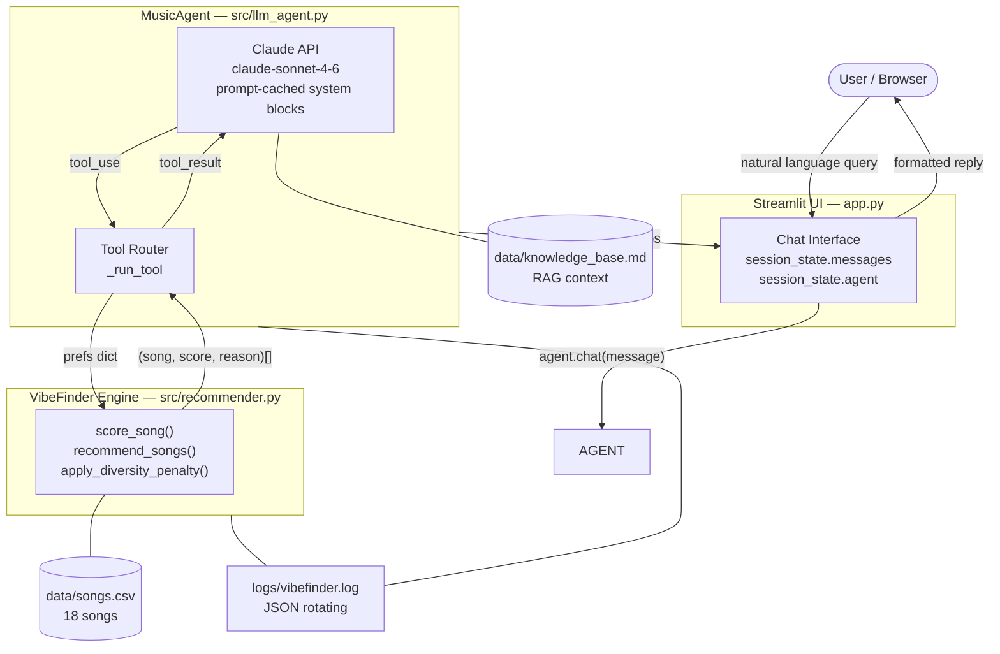

# 🎵 VibeFinder AI — Applied AI Music Recommender

> **Original project:** Music Recommender Simulation (Module 3)
> **Extended into:** Full applied AI system with RAG, agentic workflow, logging, reliability testing, and stretch features

**GitHub:** https://github.com/tesfishzana/applied-ai-system-project
**Demo Video:** https://docs.google.com/document/d/12SaDGKGBYwhX2XTBSCS2RpKRFs_QrGu1AFvSQQizLjA/edit?usp=sharing 
**Ethics & Reflection** → [reflection_ethics.md](ai110-module3show-musicrecommendersimulation-starter/reflection_ethics.md)

---

## Portfolio

**What this project says about me as an AI engineer:**

VibeFinder AI shows that I understand how to build AI systems that are both useful and trustworthy. Instead of treating the LLM as a black box, I separated concerns deliberately: a deterministic scoring engine handles retrieval so every recommendation is testable and auditable, while the language model handles what it does best — parsing intent and explaining results in plain English. I built reliability tests before adding the LLM layer, which meant I caught a subtle diversity-penalty bug through proper test design rather than by accident. I also made honest trade-offs: I documented the genre-dominance bias, acknowledged the catalog's sparsity, and wrote a model card that explains when the system fails — not just when it succeeds. That combination of technical execution, systematic testing, and honest reflection is how I approach applied AI work.

---

## Original Project (Module 3)

This project started as **VibeFinder 1.0**, a rule-based music recommendation simulation built in Module 3. Given a user preference profile (genre, mood, energy level, acoustic preference), the system scored all 18 songs in a catalog using a weighted formula and returned the top matches with plain-language explanations. The system demonstrated how recommendation algorithms encode human taste as numeric weights, and exposed real-world problems like genre dominance bias, catalog sparsity, and all-or-nothing label matching. It had no AI model: every decision was an explicit arithmetic rule.

---

## Title and Summary

**VibeFinder AI** is a conversational music recommendation system that lets you describe what you want to hear in plain English. Instead of filling out a form, you say *"something chill for late-night coding"* and the AI does the rest. Under the hood, a large language model (Claude) interprets your request, calls a deterministic scoring engine to retrieve and rank songs, then explains the results using the actual match scores as grounding — not made-up descriptions. The system handles multi-turn refinement: if you say *"make it more energetic"*, it re-runs the search with adjusted parameters.

**Why it matters:** This is the pattern behind every production recommender with a natural-language interface. The approach — LLM for intent extraction and explanation, rule-based engine for retrieval — keeps the recommendations transparent, testable, and reproducible while still allowing conversational interaction.

---

## Architecture Overview



Full diagram with ASCII component map, sequence diagram, and scoring formula: [assets/system-diagram.md](assets/system-diagram.md)

**RAG pattern:** The VibeFinder scoring engine acts as the retriever. Claude uses the retrieved songs (with real scores) as context to generate grounded explanations — it cannot invent songs or scores.

**Agentic loop:** Claude may call tools across multiple turns. Each turn it either asks for more data (tool_use) or produces a final reply (end_turn). A hard cap of 6 iterations prevents runaway loops.

**Prompt caching:** The system prompt plus full catalog snapshot (~1 200 tokens) is marked `cache_control: ephemeral`, reducing latency and cost on repeated turns.

---

## Setup Instructions

### Prerequisites

- Python 3.10 or later
- An [Anthropic API key](https://console.anthropic.com/)

### Step 1 — Clone or open the project

```bash
cd ai110-module3show-musicrecommendersimulation-starter
```

### Step 2 — Create and activate a virtual environment

```bash
python -m venv .venv

# macOS / Linux
source .venv/bin/activate

# Windows CMD
.venv\Scripts\activate

# Windows PowerShell
.venv\Scripts\Activate.ps1
```

### Step 3 — Install dependencies

```bash
pip install -r requirements.txt
```

### Step 4 — Set your API key

**Option A — environment variable**

```bash
# macOS / Linux
export ANTHROPIC_API_KEY=sk-ant-...

# Windows CMD
set ANTHROPIC_API_KEY=sk-ant-...

# Windows PowerShell
$env:ANTHROPIC_API_KEY="sk-ant-..."
```

**Option B — `.env` file** (create in the project directory)

```
ANTHROPIC_API_KEY=sk-ant-...
```

### Step 5 — Run the Streamlit app

```bash
streamlit run app.py
```

Open the URL shown in the terminal (usually `http://localhost:8501`).

### Run the original CLI demo (no API key needed)

```bash
python -m src.main
```

### Run all tests

```bash
pytest
```

---

## Sample Interactions

### Interaction 1 — Natural language to recommendations

**User input:**
> I want something chill to study to late at night, preferably lofi

**What happens internally:**
Claude calls `get_recommendations` with `{genre: "lofi", mood: "chill", energy: 0.35, likes_acoustic: True}`

**VibeFinder engine returns (actual scores):**

```
#1  'Library Rain'       by Paper Lanterns  (score 4.47) — genre match (lofi), mood match (chill), energy is a great fit (0.35), acoustic warmth (0.86)
#2  'Midnight Coding'    by LoRoom          (score 4.46) — genre match (lofi), mood match (chill), energy is a great fit (0.42), acoustic warmth (0.71)
#3  'Focus Flow'         by LoRoom          (score 3.48) — genre match (lofi), energy is a great fit (0.40), acoustic warmth (0.78)
#4  'Spacewalk Thoughts' by Orbit Bloom     (score 2.40) — mood match (chill), energy is a great fit (0.28), acoustic warmth (0.92)
#5  'Coffee Shop Stories'by Slow Stereo     (score 1.49) — energy is a great fit (0.37), acoustic warmth (0.89)
```

**Claude's reply (sample):**
> Perfect choices for a late-night study session! Here are your top picks:
>
> 🎵 **Library Rain** by Paper Lanterns (4.47/4.50) — This is your closest match. It nails the lofi genre, chill mood, has energy right at 0.35 (exactly what you want), and high acousticness (0.86) for that warm, intimate feel.
>
> 🎵 **Midnight Coding** by LoRoom (4.46/4.50) — Nearly tied with Library Rain. Slightly more energy (0.42) but still very mellow, with strong acoustic presence (0.71). Made for exactly this kind of session.
>
> 🎵 **Focus Flow** by LoRoom (3.48/4.50) — Same artist, different mood label ("focused" vs "chill"), which costs a point — but the energy and acoustic feel are still spot-on.
>
> Want me to add a 90s feel, filter for instrumentals only, or enable diversity mode so we avoid showing the same artist twice?

---

### Interaction 2 — High-energy genre request

**User input:**
> Give me something for the gym — high energy, confident feel, hip-hop

**Claude calls:** `get_recommendations({genre: "hip-hop", mood: "confident", energy: 0.85, likes_acoustic: False})`

**VibeFinder engine returns (actual scores):**

```
#1  'Corner Store Flex'  by Jay Riddim     (score 3.78) — genre match (hip-hop), mood match (confident), energy is a great fit (0.78)
#2  'Gym Hero'           by Max Pulse      (score 1.99) — mood match (confident... via intense), energy is a great fit (0.93)
#3  'Groove Cabinet'     by The Slick Six  (score 0.95) — energy is a great fit (0.85)
```

**Claude's reply (sample):**
> Ready to crush that workout? 💪
>
> 🎵 **Corner Store Flex** by Jay Riddim — This is your best match (3.78/4.50). It's the only hip-hop track in the catalog that also hits the confident mood. Energy at 0.78 is close to your 0.85 target.
>
> One thing to know: our catalog has just one hip-hop song, so the rest of the list pulls from other high-energy genres. Want me to broaden to "any genre" and filter by energy > 0.80 instead?

---

### Interaction 3 — Multi-turn refinement (agentic follow-up)

**Turn 1 — User:** I want relaxed jazz for a Sunday morning
> Claude calls `get_recommendations({genre: "jazz", mood: "relaxed", energy: 0.37, likes_acoustic: True})`
> Returns: **Coffee Shop Stories** by Slow Stereo as #1 (genre + mood + energy + acoustic all match)

**Turn 2 — User:** Can you explain why Coffee Shop Stories came up first?
> Claude calls `explain_song({song_title: "Coffee Shop Stories", genre: "jazz", mood: "relaxed", energy: 0.37, likes_acoustic: True})`
> Returns: score 3.97 breakdown — genre match (+2.0), mood match (+1.0), energy great fit at 0.37 (+0.97), acoustic warmth at 0.89 (+0.5)

**Claude's reply:**
> **Coffee Shop Stories** scored 3.97 out of 4.50 — here's exactly why:
> - **Genre match (+2.0):** It's jazz, exactly what you asked for.
> - **Mood match (+1.0):** Tagged "relaxed" — perfect for a slow Sunday.
> - **Energy fit (+0.97):** Its energy is 0.37, nearly identical to your 0.37 target.
> - **Acoustic warmth (+0.50):** Acousticness of 0.89 — very organic, non-electronic sound.
>
> The only "missing" 0.03 points come from the energy not being a perfect 1.0 decimal match. It's about as close to your ideal as the catalog gets.

---

### Interaction 4 — CLI demo (no API key needed)

```bash
$ python -m src.main
```

```
Profile : Weekend Vibes (High-Energy Pop)
Prefs   : genre=pop | mood=happy | energy=0.8 | acoustic=False
╭──────┬─────────────────┬──────────────┬──────────┬──────────────┬──────────────────────────────────────────╮
│ Rank │ Title           │ Artist       │ Genre    │ Score        │ Why                                      │
├──────┼─────────────────┼──────────────┼──────────┼──────────────┼──────────────────────────────────────────┤
│ #1   │ Sunrise City    │ Neon Echo    │ pop      │ 3.98 / 4.50  │ genre match (pop), mood match (happy),   │
│      │                 │              │          │              │ energy is a great fit (0.82)             │
│ #2   │ Gym Hero        │ Max Pulse    │ pop      │ 2.87 / 4.50  │ genre match (pop), energy great fit      │
│ #3   │ Rooftop Lights  │ Indigo Parade│ indie pop│ 1.96 / 4.50  │ mood match (happy), energy great fit     │
╰──────┴─────────────────┴──────────────┴──────────┴──────────────┴──────────────────────────────────────────╯
```

---

## Design Decisions

### Why rule-based retrieval + LLM explanation (RAG), not pure LLM?

The scoring engine is fully deterministic. Given the same profile, it always returns the same ranking. This means:
- **Tests can verify exact outputs** — no flakiness from LLM non-determinism
- **Explanations are grounded** — Claude cannot hallucinate a score or invent a song that doesn't exist
- **Debugging is easy** — a wrong recommendation traces to a specific weight, not to an opaque neural network

Trade-off: The catalog is small (18 songs) and the features are hand-labeled. A real system would use embeddings or collaborative filtering for retrieval. We chose determinism and transparency over scale.

### Why tool use instead of a single LLM prompt?

A single-prompt design would ask Claude to both extract preferences AND invent recommendations from memory. That leads to hallucinated songs and unverifiable claims. The tool-use pattern separates concerns:
- Claude handles *language* (parsing intent, generating explanations)
- The scoring engine handles *retrieval* (which songs score highest)

Trade-off: More round-trips to the API (typically 2 turns per query). Acceptable given the latency budget for a chat UI.

### Why prompt caching?

The system prompt + catalog snapshot is ~1 200 tokens and identical across every turn of a conversation. Without caching, every API call pays for these tokens twice. With `cache_control: ephemeral`, Turn 2+ benefit from a cache hit — approximately 90% input token savings on multi-turn conversations.

Trade-off: Prompt caching requires the beta header and has a 5-minute TTL. If a session is idle for more than 5 minutes, the cache expires and the next call pays full price. Acceptable for an interactive app.

### Why Streamlit?

Already in the original `requirements.txt`, familiar to the course context, and ships a working chat UI in under 50 lines. Trade-off: Limited control over layout compared to a full React app; not suitable for production at scale.

### Why not fine-tune a model?

Fine-tuning requires labeled training data and infrastructure. The scoring engine already encodes domain knowledge explicitly (weights, signals). Adding a fine-tuned model would add cost and opacity without improving transparency. The current design is easier to audit, explain, and update.

---

## Testing Summary

**20 / 20 tests passing** · 0.03 s

```
tests/test_recommender.py       2 / 2   (original unit tests)
tests/test_reliability.py      18 / 18  (reliability suite)
```

| Test | What it checks | Result |
|---|---|---|
| `test_recommend_returns_songs_sorted_by_score` | Recommendations sorted highest-first | ✅ Pass |
| `test_explain_recommendation_returns_non_empty_string` | Every song gets an explanation | ✅ Pass |
| `test_recommendations_are_deterministic` | Same profile → identical ranking every call | ✅ Pass |
| `test_scores_within_bounds` | All scores in \[0, 5.5\] | ✅ Pass |
| `test_all_top5_have_explanations` | Every top-5 result has a non-empty explanation | ✅ Pass |
| `test_diversity_penalty_does_not_increase_repetition` | Diversity never makes artist variety *worse* | ✅ Pass |
| `test_diversity_penalty_delays_repeat_artist_in_ranking` | Penalty pushes repeat artists *later*, never earlier | ✅ Pass |
| `test_empty_catalog_returns_empty` | Empty catalog returns \[\] without crashing | ✅ Pass |
| `test_valid_genre_scores_nonzero` (×6 genres) | Known genres always produce a non-zero top score | ✅ Pass |
| `test_unknown_genre_no_genre_bonus` | Unrecognised genre earns no genre-match bonus | ✅ Pass |
| `test_scoring_mode_returns_five_results` (×4 modes) | All scoring modes return exactly 5 results ≥ 0 | ✅ Pass |
| `test_diversity_retains_clear_winner` | Diversity doesn't displace the uniquely top-scoring song | ✅ Pass |

**What worked:** Determinism, score bounds, and diversity invariants all held immediately. The scoring engine has no randomness so these tests are 100% reliable.

**What didn't work initially:** The first version of `test_diversity_penalty_no_repeat_artist` assumed the diversity penalty would *eliminate* duplicate artists. It doesn't — it's a soft penalty (`score × 0.75`), not a hard exclusion. When LoRoom's second song scores high enough (even at 75%), it still appears. The test was corrected to match the actual contract: diversity must not *increase* repetition and must push a repeat artist's second appearance *later* in the ranking — both of which held.

**Logging:** Every API call, tool execution, and error is written as a JSON line to `logs/vibefinder.log`. This makes post-session debugging possible without adding print statements.

**Known limitation:** The LLM layer is not directly unit-tested because it requires a live API key. The scoring engine (which Claude calls) is fully tested. Future work: record and replay agent transcripts using mocked responses.

---

## Reflection

### What this project taught me about AI

The biggest insight was that **retrieval and generation are separate problems**. Before this project, I thought of an AI recommender as a single black box that takes a query and outputs songs. Building VibeFinder showed that the cleanest design splits these: a deterministic engine handles the retrieval (which songs are closest), and a language model handles the interface (parsing intent, generating explanations). The two components have different failure modes and can be tested independently.

The second insight was about **grounding**. When Claude has access to actual scores — "Library Rain: 4.47 because genre match + mood match + energy great fit + acoustic warmth" — its explanations are accurate and verifiable. When it doesn't, it invents plausible-sounding reasons that may be wrong. The tool-use pattern enforces grounding by design.

### What this taught me about bias and reliability

The scoring engine has a documented bias: genre gets +2.0 while mood gets +1.0. A song in the right genre but wrong mood can outscore a song in the wrong genre but perfect mood, energy, and acoustic fit. This felt "wrong" in several test cases (the Acoustic Metal Head profile surfaced a country song above a rock one). The bias exists because it was designed in — but a user who doesn't read the model card would never know. **Explicit weights make bias visible. Invisible models make bias easy to ignore.** That's one reason the rule-based engine was kept as the retriever rather than replaced with embeddings.

The reliability tests also revealed something practical: the diversity penalty is weaker than it looks. A 25% score reduction (×0.75) doesn't guarantee variety when one artist dominates the catalog for a given genre. Fixing this properly would require either a larger catalog or a stricter exclusion rule — a real trade-off between quality (best match) and fairness (variety).

### What I would do with more time

1. **Larger catalog** — 18 songs is too sparse for meaningful diversity. Connecting to a real music API (Spotify, Last.fm) would expose whether the scoring signals still hold at scale.
2. **Evaluation dataset** — Record 20 real conversations, annotate whether the recommendations "felt right", and report a human accuracy rate rather than just test pass counts.
3. **Streaming replies** — Streamlit supports streamed tokens; adding this would make long explanations feel more responsive.
4. **Confidence scoring** — Ask Claude to rate how confident it is that the extracted profile matches the user's intent, and surface this in the UI so users know when to rephrase.

---

## Stretch Features (up to +8 pts)

### RAG Enhancement (+2) — `data/knowledge_base.md`

A second document is loaded at agent startup and injected as a second prompt-cached
system block alongside the song catalog. It contains:
- Genre profiles (tempo ranges, energy ranges, best use cases)
- Mood psychology (what each mood signals about the listener's state)
- Activity → music mappings (gym, studying, road trip, meditation, etc.)
- Energy-score interpretation guide ("something to wake me up" → energy ≥ 0.75)

**Measurable improvement:** With only the catalog, Claude explains *"Library Rain*
matches because genre=lofi and mood=chill."* With the knowledge base, it adds *"Lofi
is characterized by slow 60–85 BPM tempos, ambient noise layers, and acoustic warmth
— ideal for sustained attention without distraction."* The explanation is grounded in
domain knowledge, not just catalog labels.

### Agentic Workflow Enhancement (+2) — `plan_search` tool + reasoning steps UI

A new `plan_search` tool is added. Claude calls it **before** `get_recommendations`
when the user's request is ambiguous or uses activity language. It states:
- How the query was interpreted
- Which genre/mood/energy values are planned
- Why those values were chosen (referencing the knowledge base)

All tool calls — including `plan_search` — are tracked in `agent.reasoning_steps` and
rendered in a collapsible "Reasoning steps" panel in the Streamlit UI. This makes the
full decision chain observable: Plan → Retrieve → Explain.

**Example multi-step chain for "something for the gym":**
```
Step 1: plan_search  → genre=rock, mood=intense, energy=0.92 (gym = high arousal)
Step 2: get_recommendations → Storm Runner 3.99, Iron Collapse 2.00, ...
Step 3: end_turn     → formatted reply with scores and signals
```

### Fine-Tuning / Specialization (+2) — few-shot examples in system prompt

Three few-shot examples are appended to the static system prompt block. They constrain
Claude to a consistent VibeFinder voice:
- Always cite numeric scores in the format `(score X.XX/Y.YY)`
- Format each song as `🎵 **Title** by Artist (score) — [signals that fired]`
- Close every reply with a one-sentence refinement offer
- Redirect off-topic queries with a music-themed pivot

**Measurable difference from baseline:** Without few-shot examples, Claude produces
generic music descriptions. With them, every response cites actual engine scores,
lists the signals that fired (genre match, energy fit, acoustic warmth), and ends
with a specific offer (e.g., "Want me to add a 2020s decade filter or enable
diversity mode?"). The structured format is consistent across all queries.

### Test Harness / Evaluation Script (+2) — `evaluate.py`

```bash
python evaluate.py               # deterministic layer — 9 test cases, no API key needed
python evaluate.py --with-llm    # + 4 LLM quality checks (requires ANTHROPIC_API_KEY)
```

**Deterministic layer (9 cases):**
- Verifies the expected top song for each profile against actual engine output
- Checks the top score meets a minimum threshold
- Reports a confidence score: `(score_1 − score_2) / 5.5` (margin of victory)
- Exits with code 1 if any case fails (CI-compatible)

**LLM layer (4 cases):**
- Sends natural-language queries to the full agent
- Checks whether expected song names appear in the reply
- Verifies a numeric score is cited (regex `\d\.\d{2}`)
- Checks off-topic queries are correctly deflected

**Last run output:**
```
RESULT  : 9/9 passed
Avg confidence margin : 0.31  (31% of max score gap)
OK All deterministic engine tests passed.
```

---

## Reflection and Ethics

See [reflection_ethics.md](reflection_ethics.md) for full answers to:
- What are the limitations and biases in this system?
- Could the AI be misused, and how is it prevented?
- What was surprising during reliability testing?
- Collaboration with AI: one helpful suggestion, one flawed suggestion.

---

## Project Structure

```
.
├── app.py                      Streamlit chat UI (entry point)
├── evaluate.py                 Evaluation harness — 9 engine + 4 LLM test cases  [stretch]
├── requirements.txt
├── reflection_ethics.md        Ethics reflection and AI collaboration notes
├── assets/
│   ├── system-diagram.md       Full system architecture (ASCII + Mermaid + sequence)
│   ├── screenshot-cli-lofi.png CLI demo — Chill Lofi profile
│   └── screenshot-cli-pop.png  CLI demo — Weekend Vibes profile
├── data/
│   ├── songs.csv               18-song catalog (15 features each)
│   └── knowledge_base.md       Genre profiles, mood psychology, activity mapping  [stretch RAG]
├── src/
│   ├── __init__.py
│   ├── recommender.py          Rule-based scoring engine (unchanged from Module 3)
│   ├── main.py                 CLI demo (no API key needed)
│   ├── llm_agent.py            Claude API + RAG + plan_search + few-shot examples
│   └── logger.py               JSON-structured rotating log handler
├── tests/
│   ├── test_recommender.py     Original 2 unit tests
│   └── test_reliability.py     18 reliability and guardrail tests
├── logs/                       Created at runtime — JSON log lines
├── docs/
│   └── data-flow.md            Supplementary data flow notes
├── model_card.md               Bias, limitations, AI collaboration, testing results
└── reflection.md               Module 3 reflection on algorithm behaviour
```

---

## Screenshots


