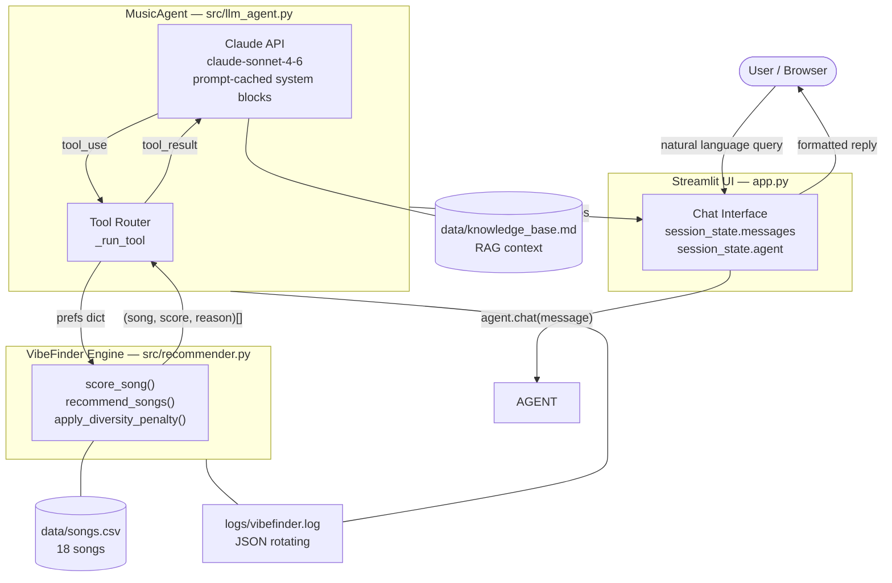

# VibeFinder AI — System Architecture Diagram

## Component Map

```
┌─────────────────────────────────────────────────────────────────────────────┐
│                          VibeFinder AI System                               │
│                                                                             │
│  ┌──────────────┐    natural language query                                 │
│  │   User /     │─────────────────────────────────────────────────────┐    │
│  │  Browser     │◀─────────────────────────────────────────────────── │    │
│  └──────────────┘    formatted reply + scores                         │    │
│                                                                        │    │
│  ┌─────────────────────────────────────────────────────────────┐      │    │
│  │  Streamlit UI  (app.py)                                     │      │    │
│  │  · Session state: messages[], agent                         │◀─────┘    │
│  │  · Renders chat history + "Reasoning steps" expanders       │           │
│  │  · API key guard, sidebar profile display                   │           │
│  └───────────────────────────┬─────────────────────────────────┘           │
│                              │  user_message                               │
│                              ▼                                             │
│  ┌─────────────────────────────────────────────────────────────┐           │
│  │  MusicAgent  (src/llm_agent.py)                             │           │
│  │                                                             │           │
│  │  ┌───────────────────────────────────────────────────────┐  │           │
│  │  │  Claude API  (claude-sonnet-4-6)                      │  │           │
│  │  │  System prompt (prompt-cached):                       │  │           │
│  │  │    · Core instructions + guardrails                   │  │           │
│  │  │    · 18-song catalog snapshot                         │  │           │
│  │  │    · Knowledge base (genres, moods, activities) [RAG] │  │           │
│  │  │    · 3 few-shot examples [specialization]             │  │           │
│  │  └──────────────────────┬────────────────────────────────┘  │           │
│  │                         │  tool_use / end_turn               │           │
│  │                         ▼  (agentic loop, max 8 iters)       │           │
│  │  ┌───────────────────────────────────────────────────────┐  │           │
│  │  │  Tool Router  (_run_tool)                             │  │           │
│  │  │                                                       │  │           │
│  │  │  plan_search          get_recommendations  explain_song│  │           │
│  │  │  (state intent)       (call engine)        (score song)│  │           │
│  │  └───────────────────────────────────────────────────────┘  │           │
│  └─────────────────────────┬───────────────────────────────────┘           │
│                            │  prefs dict                                   │
│                            ▼                                               │
│  ┌─────────────────────────────────────────────────────────────┐           │
│  │  VibeFinder Scoring Engine  (src/recommender.py)            │           │
│  │                                                             │           │
│  │  score_song(song, prefs) → float                            │           │
│  │  Signals:                                                   │           │
│  │    genre match    +2.00   (strongest)                       │           │
│  │    mood match     +1.00                                     │           │
│  │    energy fit     +0–1.00 (1.0 − |Δ energy|)               │           │
│  │    acoustic       +0.50   (if acousticness ≥ 0.60)         │           │
│  │    era match      +0.25   (preferred_decade)                │           │
│  │    mood tags      +0.10   (each, max 3)                     │           │
│  │    popularity     +0.20   (proximity to target)             │           │
│  │    instrumental   +0.25   (if instrumentalness ≥ 0.70)     │           │
│  │                                                             │           │
│  │  max score = 5.50   apply_diversity_penalty(×0.75 repeat)  │           │
│  └─────────────────────────┬───────────────────────────────────┘           │
│                            │                                               │
│               ┌────────────┴──────────────┐                               │
│               ▼                           ▼                               │
│  ┌──────────────────┐      ┌─────────────────────────┐                    │
│  │  data/songs.csv  │      │  data/knowledge_base.md  │                    │
│  │  18 songs        │      │  Genre profiles          │                    │
│  │  15 features     │      │  Mood psychology         │                    │
│  │  each            │      │  Activity → music map    │                    │
│  └──────────────────┘      └─────────────────────────┘                    │
│                                                                             │
│  ┌─────────────────────────────────────────────────────────────┐           │
│  │  Logging  (src/logger.py)                                   │           │
│  │  JSON lines → logs/vibefinder.log  (rotating, 5 MB max)    │           │
│  └─────────────────────────────────────────────────────────────┘           │
└─────────────────────────────────────────────────────────────────────────────┘
```

---

## Mermaid Flowchart



---

## Request Sequence

```
User            Streamlit       MusicAgent        Claude API      VibeFinder Engine
 |                 |                |                  |                  |
 |-- query ------> |                |                  |                  |
 |                 |-- chat() ----> |                  |                  |
 |                 |                |-- messages[] --> |                  |
 |                 |                |                  |                  |
 |                 |                |  <-- tool_use: plan_search ------   |
 |                 |                |-- _run_tool() -->|                  |
 |                 |                |  tool_result ------>               |
 |                 |                |                  |                  |
 |                 |                |  <-- tool_use: get_recommendations  |
 |                 |                |-- _run_tool() -------------------- >|
 |                 |                |  <-------- (song, score, reason)[] -|
 |                 |                |  tool_result ------>               |
 |                 |                |                  |                  |
 |                 |                |  <-- end_turn + reply text          |
 |                 |<-- reply  ---- |                  |                  |
 |<-- renders  --- |                |                  |                  |
```

---

## Scoring Formula

```
score(song, prefs) =
    2.00 × (song.genre == prefs.genre)
  + 1.00 × (song.mood == prefs.mood)
  + max(0, 1.0 − |song.energy − prefs.energy|)
  + 0.50 × (prefs.likes_acoustic AND song.acousticness ≥ 0.60)
  + 0.25 × (song.release_decade == prefs.preferred_decade)         [advanced]
  + 0.10 × |{t ∈ song.tags} ∩ prefs.desired_mood_tags}|            [advanced, max 3]
  + 0.20 × max(0, 1 − |song.popularity − prefs.popularity_target|/100)  [advanced]
  + 0.25 × (prefs.wants_instrumental AND song.instrumentalness ≥ 0.70)  [advanced]

max possible = 5.50

diversity_penalty: repeat artist → score × 0.75 (soft, not hard exclusion)
```
