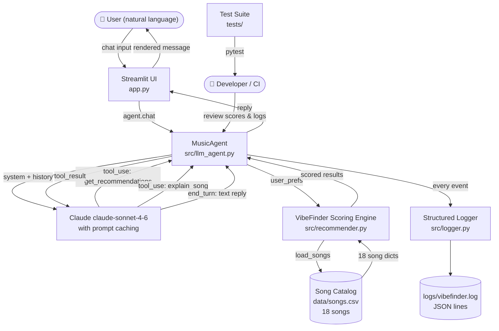
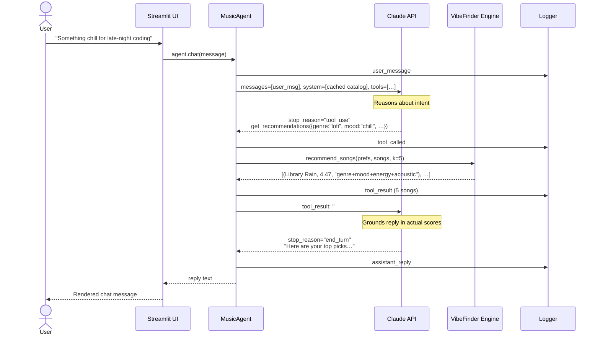

# VibeFinder AI — System Architecture & Data Flow

## Component Map (ASCII)

```
┌────────────────────────────────────────────────────────────────────────┐
│                          VIBEFINDER AI SYSTEM                          │
│                                                                        │
│  ┌──────────┐    ┌──────────────────┐    ┌──────────────────────────┐ │
│  │   User   │───▶│  Streamlit UI    │───▶│     MusicAgent           │ │
│  │  (chat)  │◀───│  app.py          │◀───│   src/llm_agent.py       │ │
│  └──────────┘    └──────────────────┘    └──────────┬───────────────┘ │
│                                                      │  orchestrates   │
│                             ┌────────────────────────┤                │
│                             ▼                        ▼                │
│              ┌─────────────────────────┐  ┌────────────────────────┐  │
│              │      Claude API         │  │  VibeFinder Scorer     │  │
│              │   (claude-sonnet-4-6)   │  │  src/recommender.py    │  │
│              │                         │  │                        │  │
│              │  · Parses intent        │  │  · Scores 18 songs     │  │
│              │  · Calls tools          │  │  · Ranks by score      │  │
│              │  · Explains output      │  │  · Applies diversity   │  │
│              │  · Prompt caching       │  │  · Returns explanations│  │
│              └─────────────────────────┘  └───────────┬────────────┘  │
│                      ▲   │ tool results               │               │
│                      └───┘                            ▼               │
│                                            ┌────────────────────────┐ │
│                                            │     Song Catalog       │ │
│                                            │   data/songs.csv       │ │
│                                            │  18 songs × 15 cols    │ │
│                                            └────────────────────────┘ │
│                                                                        │
│  ┌─────────────────────────────────────────────────────────────────┐  │
│  │  Structured Logger  src/logger.py  →  logs/vibefinder.log (JSON)│  │
│  │  Records: query · tool calls · LLM tokens · errors              │  │
│  └─────────────────────────────────────────────────────────────────┘  │
│                                                                        │
│  ┌─────────────────────────────────────────────────────────────────┐  │
│  │  Test Suite  tests/                                              │  │
│  │  test_recommender.py  ( 2 unit tests)  ──────┐                  │  │
│  │  test_reliability.py  (18 test cases)  ──────┴──▶ Human review  │  │
│  │  20 / 20 passing · 0.03s                                        │  │
│  └─────────────────────────────────────────────────────────────────┘  │
└────────────────────────────────────────────────────────────────────────┘
```

---

## Mermaid — Full System Diagram



---

## Request / Response Sequence



---

## Agentic Tool-Use Loop

```
MusicAgent.chat(user_message)
│
├─ Iteration 1 ─────────────────────────────────────────────────────────
│   Claude receives: [system_prompt+catalog (cached), user_message]
│   Claude infers intent → calls get_recommendations({…})
│   stop_reason = "tool_use"
│   │
│   _run_tool("get_recommendations", prefs)
│   → recommend_songs() → scored list → formatted string
│   → append tool_result to conversation history
│
├─ Iteration 2 ─────────────────────────────────────────────────────────
│   Claude receives: […history, tool_result]
│   Claude writes explanation grounded in actual scores
│   stop_reason = "end_turn"
│   │
│   Return final text reply to Streamlit
│
└─ (Up to 6 iterations; additional turns on user follow-up)
```

---

## Scoring Engine Detail

```
score(user, song) =
    genre_w  × [song.genre == user.genre]            ← +2.0  if match
  + mood_w   × [song.mood  == user.mood]             ← +1.0  if match
  + energy_w × max(0,  1 − |song.energy − user.E|)  ← 0–1.0 gradient
  + acoustic × [likes_acoustic ∧ acousticness ≥ 0.6] ← +0.5
  ─── advanced bonuses (Challenge 1) ────────────────────────────────
  + 0.25  exact decade match
  + 0.10  per matching mood tag (max 3 tags = +0.30)
  + 0.20  popularity proximity (linear decay, 50-pt window)
  + 0.25  wants_instrumental ∧ instrumentalness ≥ 0.70
  ────────────────────────────────────────────────────────────────────
  Maximum possible score = 5.5
```

## Score Breakdown Table

| Signal | Max pts | Formula |
|---|---|---|
| Genre match | +2.00 | exact string match |
| Mood match | +1.00 | exact string match |
| Energy similarity | +1.00 | `max(0, 1 − |Δenergy|)` |
| Acoustic bonus | +0.50 | `likes_acoustic=True` and `acousticness ≥ 0.6` |
| Decade match | +0.25 | exact string match |
| Mood tag overlap | +0.30 | +0.10 per tag, max 3 |
| Popularity fit | +0.20 | `max(0, 0.20 × (1 − |Δpop| / 50))` |
| Instrumental | +0.25 | `wants_instrumental=True` and `instrumentalness ≥ 0.70` |
| **Total max** | **5.50** | |

---

## Where Humans Are Involved

| Stage | Human role |
|---|---|
| Query input | User describes preference in free-form natural language |
| Result refinement | User reacts, triggers another agentic turn |
| Log review | Developer monitors `logs/vibefinder.log` after sessions |
| Test review | Developer runs `pytest` and reviews pass/fail summary |
| Model evaluation | Bias, edge cases, and limitations documented in `model_card.md` |

---

## Prompt Caching

The static system prompt + full catalog snapshot (~1 200 tokens total) is
marked `cache_control: ephemeral`. On Turn 2+ of a conversation the Claude
server returns a cache hit, reducing latency and input-token cost.

---

## Log Line Examples

```json
{"ts":"2026-04-28T18:23:41.123Z","level":"INFO","logger":"vibefinder.agent",
 "msg":"llm_turn","iteration":0,"stop_reason":"tool_use",
 "input_tokens":1247,"output_tokens":89}

{"ts":"2026-04-28T18:23:41.456Z","level":"INFO","logger":"vibefinder.agent",
 "msg":"tool_called","tool":"get_recommendations",
 "input":{"genre":"lofi","mood":"chill","energy":0.38,"likes_acoustic":true}}

{"ts":"2026-04-28T18:23:41.789Z","level":"INFO","logger":"vibefinder.agent",
 "msg":"tool_result","tool":"get_recommendations","n_results":5}

{"ts":"2026-04-28T18:23:42.234Z","level":"INFO","logger":"vibefinder.agent",
 "msg":"assistant_reply","length":412}
```
